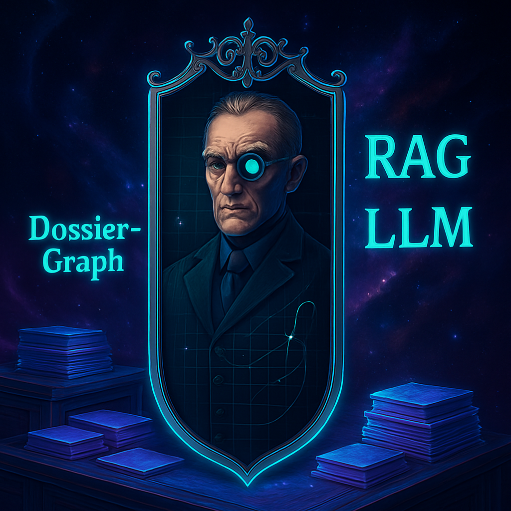

{width=350px; heigh=450px}

# Project summary {-}

Dossier-Graph is an open-source and free knowledge graph system designed for research and education, built on public data from transparent health technology assessments [@IQWiG2023].

Its mission: transform a vast archive of dossier evaluations into a live, searchable database using AI.

### Key Features {-}

- Flexible, Traceable Linking:

  - Connects dossiers, addenda, tables, sections, and more complex conceptual relationships.

  - Ensures both human-readable and machine-consumable navigation paths.

- AI-Driven Search & Analysis:

  - Automates extraction, semantic search, and interactive analysis.

  - Users ask questions in natural language and receive comprehensive, cross-document answers instantly.

### Why it matters {-}
Clinical development of new medicines differs from many business models because it relies critically on voluntary, even  [altruistic](https://onlinelibrary.wiley.com/doi/abs/10.1353/hcr.0.0164) [@jansen2009ethics] research participation and hence on [public trust](https://academic.oup.com/bjps/advance-article-abstract/doi/10.1093/bjps/axz023/5524669?redirectedFrom=fulltext). *"Information gain per unit of accepted research burden"* is a useful concept [introduced](https://www.youtube.com/watch?v=5ECTE0gbwFU=0m52s) to think about how regulatory oversight learns from past [clinical R&D efforts](https://www.ema.europa.eu/en/documents/other/laboratory-patient-journey-centrally-authorised-medicine_en.pdf) -- a prerequisite of earning public trust. Information is gained not only from conducting clinical research but throughout the entire regulatory process, including post-marketing health technology assessment. Therefore, research responsibilities to maximize available information extend well beyond publishing study results. 

In this spirit, the Dossier-Graph knowledge graph is designed to transform post-marketing health technology assessment data into actionable insights, honoring the contributions of the many patients involved in the underlying research.

By integrating state-of-the-art information technology throughout the drug development and regulatory lifecycle, this project advances the actionable use of critical research information.

### Found a mistake? {-}
[Open peer-review](http://www.openreviewtoolkit.org/) is enabled in this project using [hypothes.is](https://web.hypothes.is/). This allows sentence-by-sentence annotation from readers directly on this page. Please feel free to annotate. Both constructive and destructive criticism is [highly welcome](http://www.youtube.com/watch?v=ztmvtKLuR7I&t=10m48s).
